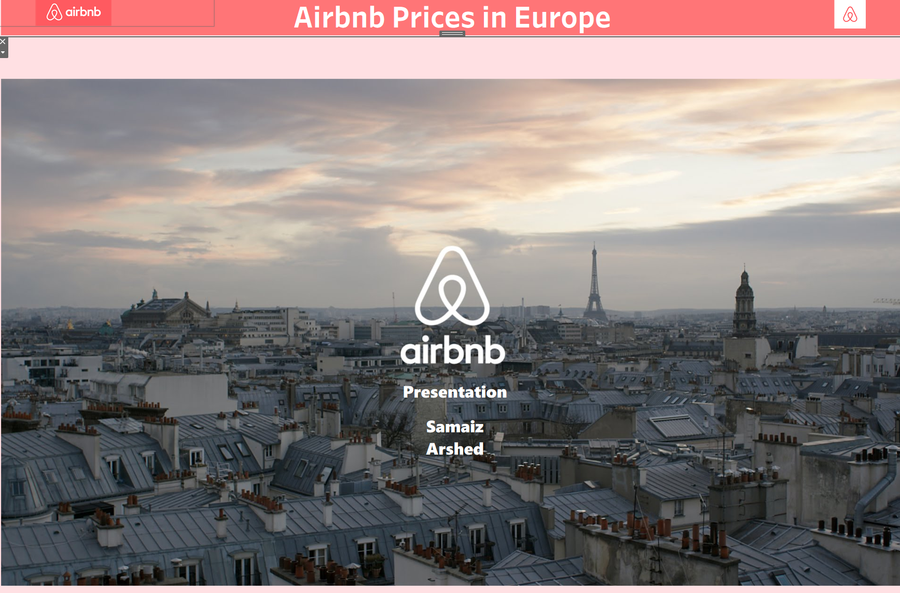
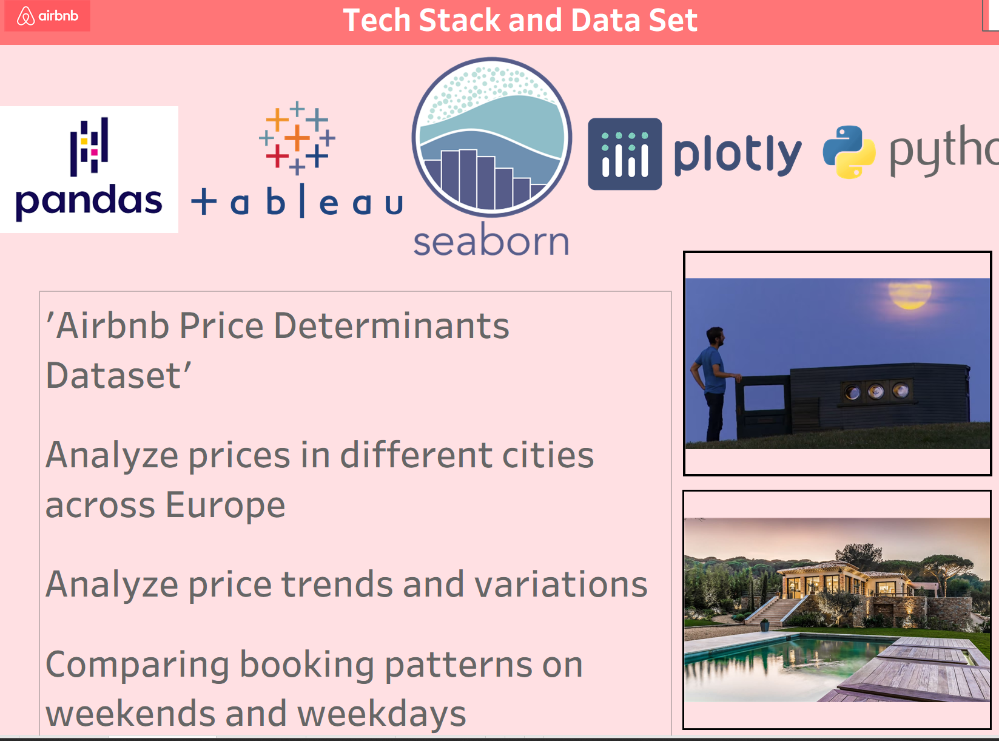
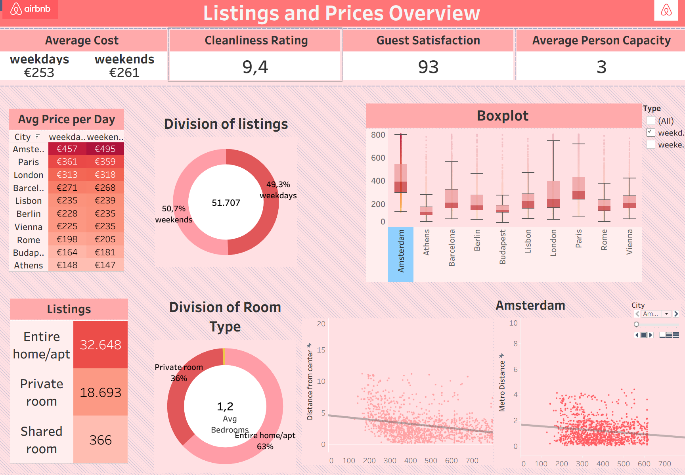
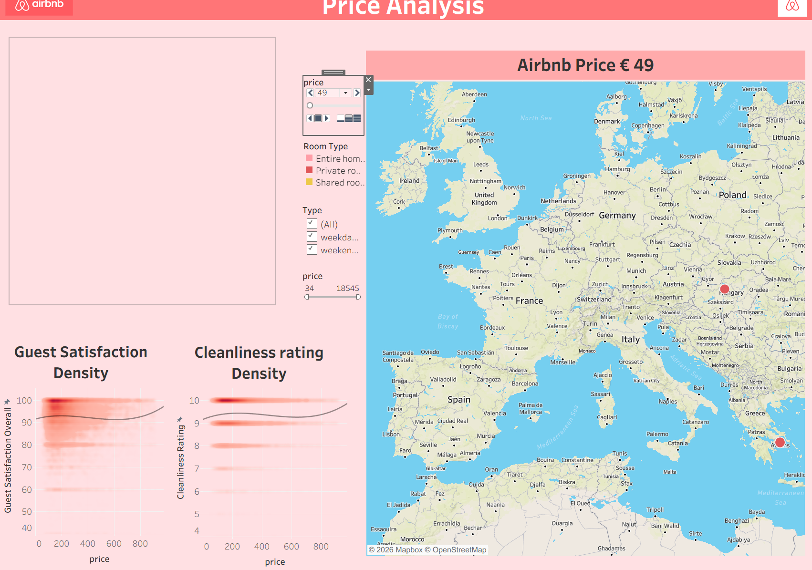
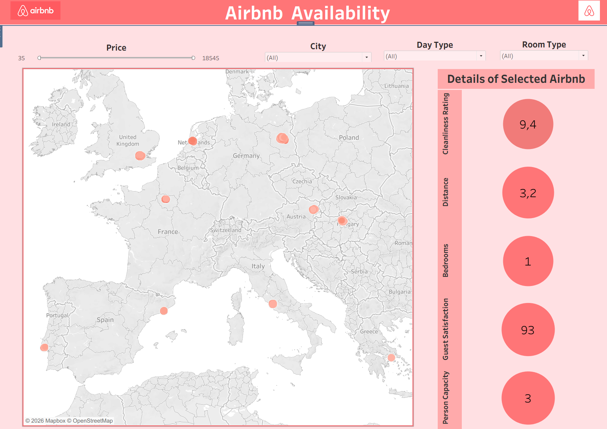

# Airbnb Price Analysis in European Cities

## Project Overview
This project focuses on consolidating Airbnb listing prices across various major European cities and creating insightful visualizations using Tableau. The goal is to understand pricing trends, availability, and factors influencing the cost of stays in different urban environments.

## Repository Structure
- **`dashboards/`**: Contains Tableau Packaged Workbooks (`.twbx`) with the final visualizations.
  - `Airbnb prices presentation.twbx`: The main Tableau workbook.
- **`data/`**: (Optional) Contains the raw or processed datasets used for the analysis.
- **`images/`**: Screenshots of the Tableau dashboards for quick reference.

## Visualizations
Here are some previews of the dashboards created in this project:

### Dashboard Previews

*Price distribution and density across European cities.*

*Detailed breakdown of room types and availability.*

*Correlation between ratings and pricing.*

*Geospatial analysis of Airbnb listings.*

*Comparative study of top-performing neighborhoods.*

## Getting Started
To view the interactive dashboards:
1. Navigate to the `dashboards/` directory.
2. Download the `Airbnb prices presentation.twbx` file.
3. Open the file using [Tableau Desktop](https://www.tableau.com/products/desktop) or [Tableau Public](https://public.tableau.com/s/).

## Data Analysis Highlights
The Tableau dashboards provide insights into:
- **Price Benchmarking**: How cities compare in terms of median and average night rates.
- **Room Type Trends**: The dominance of entire apartments vs. private rooms in different markets.
- **Geospatial Concentration**: Identifying the 'hotspots' for Airbnb listings in cities like Paris, London, and Berlin.
- **Value for Money**: Analysis of ratings versus price points.

## Author
Developed as part of a data visualization project to explore European travel trends.
